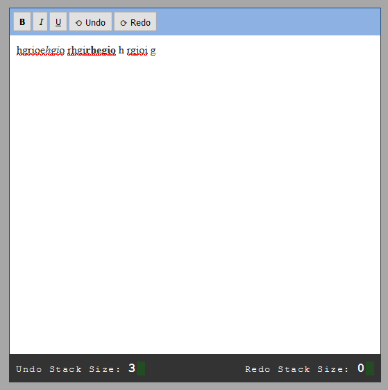
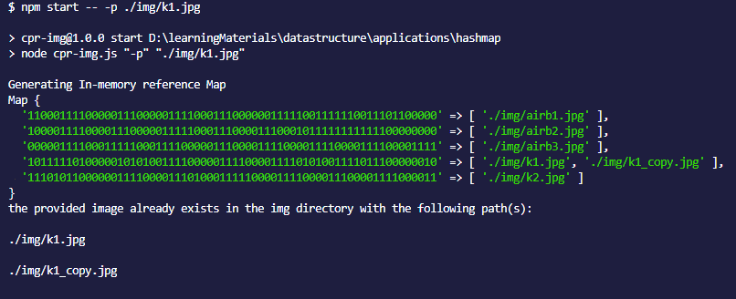

## Data Structures Practical Applications

---

A repo that I built to demonstrate the practical applications of basic data structures in the real world, to my mentees.
**_This is a work in progress and more examples will be added in the future._**

---

### Contents

##### 1.Stack

    

In this example two stacks are used to implement the undo and redo functionality of a basic and simple text editor.

##### 2.Hashmap

    

In this example we utilize hashmaps to check if a duplicate image exists in a directory
